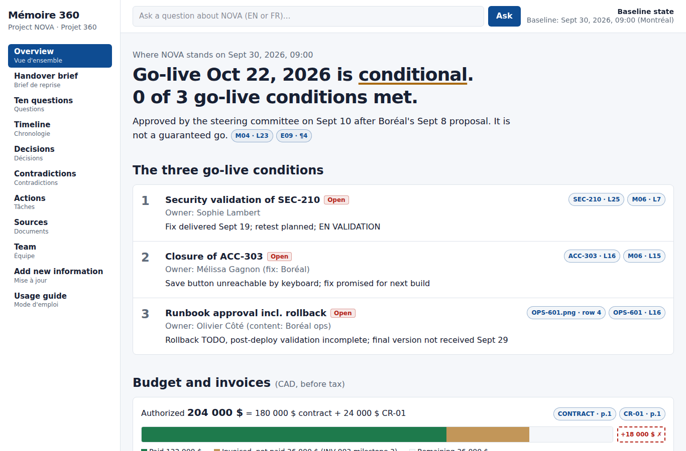
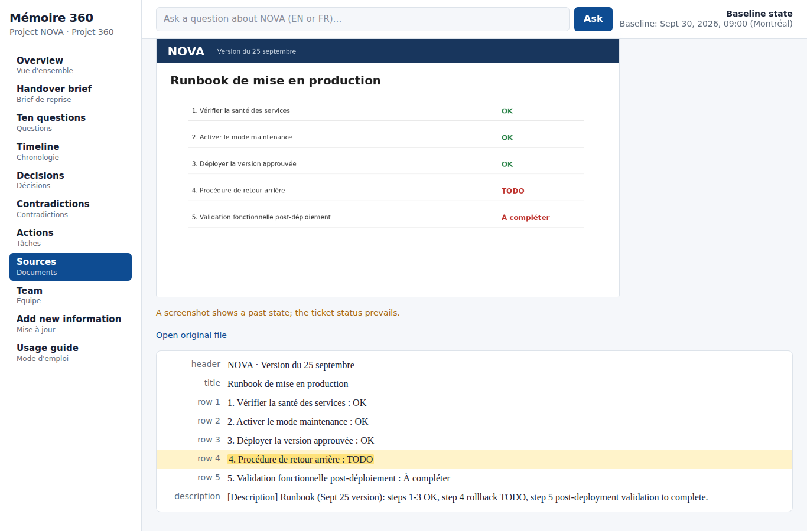
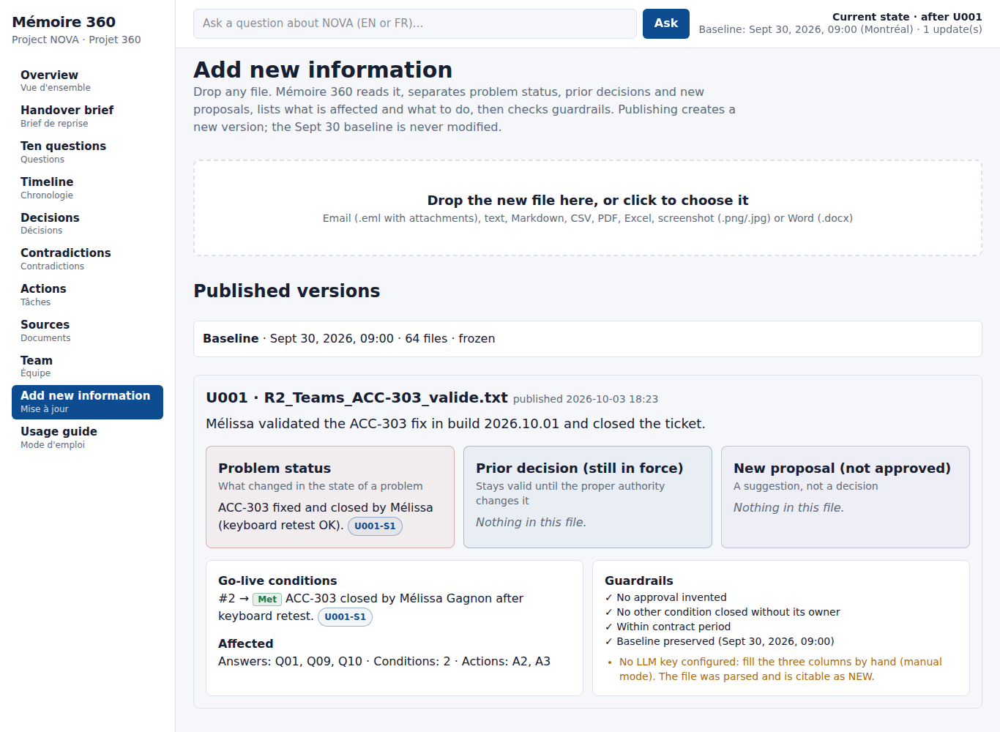
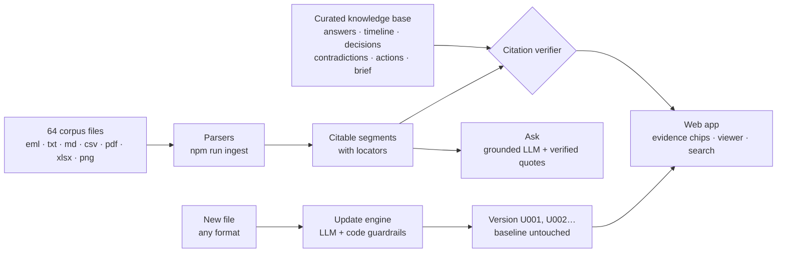

<div align="center">

# Mémoire 360

### The operational memory of project NOVA

**Take over a project in 10 minutes, with proof.**

CodeML 2026 · Loto-Québec Challenge 2 · *Projet 360 / NOVA*

</div>

---

Mémoire 360 turns 64 scattered project files (emails with attachments, meeting transcripts, tickets with screenshots, plans, contracts, invoices, architecture decisions, Teams chats and archives) into a reliable, navigable memory. Someone taking over NOVA tomorrow morning can see where the project stands, check every claim against its source in one click, ask questions in plain English or French, and integrate new information without losing the history.



## Contents

- [Why it matters](#why-it-matters)
- [Features](#features)
- [Quick start](#quick-start)
- [Five-minute tour for judges](#five-minute-tour-for-judges)
- [How it works](#how-it-works)
- [Using the app](#using-the-app)
- [Project structure](#project-structure)
- [Tools, manual steps and verification](#tools-manual-steps-and-verification)
- [Limits and uncertain information](#limits-and-uncertain-information)
- [Roadmap](#roadmap)

## Why it matters

Project knowledge decays fast. In the NOVA dossier, the information is not just scattered, it is **contradictory and full of traps**:

- A project plan dated Sept 12 still shows the old go-live date, after the committee had approved a new one.
- A risk register dated Sept 29 still lists a connector risk that was closed on Sept 17.
- A status report shows security and accessibility as green while both are still open.
- A vendor says a fix is done; the security team has not accepted it.
- Five PDFs exist twice (as email attachments and as standalone files), and one email is duplicated in the archives.

A recent file date does not make information true. Mémoire 360 is built around that idea: **every statement carries its evidence, and every source carries its authority.**

## Features

| Capability | What you get |
|---|---|
| **Overview** | Honest project status: *"Go-live Oct 22, 2026 is conditional. 0 of 3 go-live conditions met."* Conditions tracker, budget bar (authorized vs invoiced vs paid), next actions |
| **One-page handover brief** | Owner, approved date and conditions, scope, budget, invoices, priorities. Prints on a single page |
| **Ten sourced answers** | The ten challenge questions, answered in English with a French summary, each backed by at least two distinct sources and the traps avoided |
| **Timeline** | Every event tagged as proposal, decision, delivery or validation |
| **Decisions** | Lifecycle view: who proposed, who decided, what was delivered, what was validated |
| **Contradictions** | Conflicting sources side by side, resolved by authority or by the date of the facts |
| **Actions** | Owners (confirmed or proposed), evidence, due date or *to be confirmed*, documented commitment vs our recommendation |
| **Evidence viewer** | Opens any file at the exact line, email paragraph, PDF page, spreadsheet cell or screenshot row, highlighted |
| **Search** | Full-text search across every line, page, cell and screenshot transcription, accent-insensitive |
| **Ask** | Natural-language questions (EN/FR). Answers come only from the corpus, and every citation is machine-checked against the source text |
| **Add new information** | Drop any file. The system separates *problem status*, *prior decision still in force* and *new proposal*, lists affected items and actions, enforces guardrails, then publishes a new version. The baseline is never modified |



## Quick start

**Prerequisites:** [Node.js](https://nodejs.org) 20.9 or newer (22 LTS recommended) and Git.

```bash
git clone https://github.com/Arley100/memory_360_NOVA.git
cd memory_360_NOVA
npm install
npm run ingest     # index the corpus and verify every citation
npm run dev        # http://localhost:3000
```

`npm run ingest` should end with:

```
Indexed 64 files → 69 sources, 767 segments.
Duplicates (6): ...
Citations verified: 138/138
```

### Optional: enable Ask and automatic update analysis

Everything except *Ask* and automatic analysis of new files works with no account, no key and no subscription. To enable those two features, create `.env.local` from the template:

```bash
cp .env.example .env.local          # Windows PowerShell: Copy-Item .env.example .env.local
```

Then set **one** of:

| Provider | Variables |
|---|---|
| Anthropic | `ANTHROPIC_API_KEY` (optional `LLM_MODEL`) |
| Any OpenAI-compatible API (OpenAI, Mistral, Groq, local server…) | `OPENAI_API_KEY`, `LLM_MODEL`, optional `OPENAI_BASE_URL` |

Keys are only used on the server and never reach the browser.

### Production build

```bash
npm run build
npm start
```

## Five-minute tour for judges

1. **Overview** → read the status line, then click the `OPS-601.png · row 4` chip: the runbook screenshot opens with the missing rollback step highlighted.
2. **Ten questions** → open any answer and click its chips; each opens the exact passage in the source.
3. **Contradictions** → C1 (plan v3 still says Oct 15) and C2 (risk register still lists a closed risk), with the rule used to resolve them.
4. **Sources** → search `rollback`, `CR-04` or `echeance` (accents optional).
5. **Add new information** → drop `rehearsal/R2_Teams_ACC-303_valide.txt` and publish: the overview moves to *1 of 3 conditions met*, while the baseline stays intact. Delete `data/updates/U001` to reset.



## How it works



**Two layers.** A curated knowledge base (`data/baseline/kb.json`), written and checked by the team, holds the answers that matter. The app renders it, links every claim to its source, answers new questions, and ingests new files.

**Locators.** Every citation points to a precise place and stores the verbatim French quote:

| Source type | Locator | Example chip |
|---|---|---|
| Text, transcript, ticket | line | `M04 · L23` |
| Email | paragraph or header | `E05 · ¶3` |
| PDF | page | `INV-003 · p.1` |
| Spreadsheet | cell | `PLAN-V3 · F7` |
| Screenshot | transcribed row | `OPS-601.png · row 4` |

**Citation verification.** A quote counts only if it is found word for word in the cited file. This runs at build time over the whole knowledge base and at runtime on every chat answer; unverifiable citations are removed and flagged.

**Authority over recency.** Each source is classified (decision, validation, official, vendor claim, report, draft, informal, unofficial, unrelated) and duplicates are detected by SHA-256, so a copied attachment never counts as independent confirmation.

**Guardrails on updates** (`src/lib/update.ts`), applied in code after the model:

- A "decision" without a quoted approval by the proper authority is downgraded to a proposal.
- A go-live condition closes only if the new file quotes its validating owner closing it (SEC-210 → security, ACC-303 → accessibility, runbook → operations).
- A new date proposal never replaces the approved Oct 22 decision on its own.
- Any date after the contract end (Oct 31, 2026) is flagged.

## Using the app

| Page | Purpose |
|---|---|
| Overview | Status, go-live conditions, budget, next actions, changes since baseline |
| Handover brief | One-page brief, print with Ctrl+P |
| Ten questions | Challenge answers with evidence and traps avoided |
| Timeline · Decisions · Contradictions · Actions | The consultable memory |
| Sources | Every file with its authority and role; full-text search |
| Team | People, roles and what they own |
| Add new information | Upload, review, publish a new version |
| Usage guide | In-app version of this guide |

The header always shows which version you are reading: *Baseline (Sept 30, 2026, 09:00)* or *Current state after U00n*.

## Project structure

```
corpus/                     Challenge files, unchanged (fictional data)
data/
  baseline/kb.json          Curated knowledge base (frozen)
  registry.meta.json        Id, authority and role for each file
  vision/                   Screenshot transcriptions (human-checked)
  registry.json             Generated: sources
  segments.json             Generated: citable segments
  updates/                  Published versions U001, U002…
scripts/ingest.ts           Build the index and verify citations
src/
  app/                      Pages and API routes (ask, update, raw files)
  components/               Evidence chips, viewers, explorer, change sets
  lib/                      Parsers, citation resolver, LLM adapter, guardrails
rehearsal/                  Practice files for the live update (simulations)
SPEC.md                     Full team specification
```

## Tools, manual steps and verification

**Stack:** Next.js 16, React 19, TypeScript, Tailwind CSS 4, mailparser, unpdf, SheetJS, mammoth, tsx. Optional LLM via the Anthropic API or any OpenAI-compatible API.

**Manual steps:**

- The ten answers, timeline, decisions, contradictions, actions and brief were curated by the team and verified line by line against the corpus.
- The eight baseline screenshots were transcribed and checked by a human (`data/vision/transcriptions.json`).
- Every update is reviewed by a person before it is published.

**Automated checks:**

- All 64 files are indexed; the 6 duplicate files are detected automatically.
- 138 of 138 knowledge-base citations are verified verbatim against the corpus on every `npm run ingest`.

## Limits and uncertain information

**Limits**

- A model can still misinterpret a source: citations are checked, interpretation is not.
- Screenshots show a past state; the ticket status prevails.
- New screenshots uploaded live need a vision-capable model to be read.
- Spreadsheet formulas are read as displayed values.

**Not documented in the corpus as of Sept 30, 2026, 09:00**

- The SEC-210 security retest date (planned, not dated).
- The build date of the ACC-303 fix ("next build").
- The delivery and approval date of the final runbook.
- The approval status of INV-003's milestone line (36 000 $).
- Validation of the SSO-only setting in production.
- Data location is verified for the target environment (Canada Central); production is not live yet.

## Roadmap

- Evidence side drawer (open sources without leaving the page)
- English/French interface toggle
- Static Markdown export of the memory for zero-setup reading
- Hosted deployment
- Multi-project comparison and automatic executive briefing (challenge bonus)

## Data and license

All people, companies and data in the corpus are **fictional** and were provided by the organizers for the CodeML 2026 hackathon; the corpus is not covered by this project's code license. Code license: to be confirmed by the team.

---

<div align="center">
Built in 24 hours at <b>CodeML 2026</b> · PolyAI · Polytechnique Montréal
</div>
