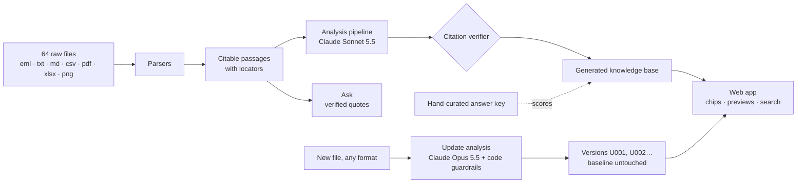

<div align="center">

# Mémoire 360

### The operational memory of project NOVA, built by AI from the raw files, with proof

CodeML 2026 · Loto-Québec Challenge 2 · *Projet 360 / NOVA* · [Live demo](https://memory-360-nova.vercel.app)

</div>

---

Taking over a project means reading everything. The NOVA dossier holds 64 files: emails with attachments, meeting transcripts, tickets with screenshots, plans, contracts, invoices, architecture decisions and Teams chats. They contradict each other: a plan still shows the old go-live date, a risk register lists a risk closed two weeks earlier, a status report says "green" while security and accessibility are still open, and a vendor calls a fix "done" before anyone validated it.

**Mémoire 360 reads all 64 files and builds the project's memory itself**: the answers, the current state, the timeline, the decisions, the contradictions, the actions and a one-page brief. Every sentence carries its evidence, and every quote is checked word for word against its source.


## Results

| What we measured | Result |
|---|---|
| Knowledge base built by AI from the raw files | **75 to 125 s** · **200+ citations, all verified word for word, 0 removed** |
| Its answers to the 10 official questions vs a hand-curated answer key | **10/10** contain every key fact |
| Evaluation on 29 questions (10 official, 8 examples from the brief, 8 trap questions, 3 the files cannot answer), from the raw files only, distractor files included | **29/29** · **273/273 citations verified** · median answer **7.6 s** |
| Model comparison on the same 29 questions | Claude Sonnet 5.5: 29/29 in 7.4 s · Claude Opus 5.5: 29/29 in 14.3 s, 3.5× the cost. Sonnet answers questions; Opus analyzes updates |

## Features

**Build from sources.** One click and Mémo, the system's presence, works through nine visible steps: it reads the dossier, finds the questions to answer in the dossier's own README, answers them, works out the go-live conditions, budget and people, rebuilds the timeline and the decisions, resolves contradictions, plans actions, writes the brief, checks every citation and compares the answers with the answer key. Nothing about NOVA is hardcoded.


**Evidence everywhere.** Every claim has a citation chip. Hovering (or tabbing onto) a chip shows the exact passage with the quote highlighted and confirms it was found word for word; clicking opens the file at the exact line, email paragraph, PDF page, spreadsheet cell or screenshot row.


**Questions.** The questions come from the dossier's README. Each answer is cited, has a French summary and the traps it avoids, and is checked against the answer key. Each answer shows when it was computed, and answers made stale by an update can be recomputed.


**Ask, in English or French.** Answers come only from the files. Unverifiable quotes are removed; missing information is reported as "not documented" instead of guessed.

**Add new information.** Drop any file: email with attachments, Word, PDF, Excel, PowerPoint, calendar invite, Teams export, screenshot, or a zip of several. The analysis runs in visible stages, then separates **problem status**, **prior decision still in force** and **new proposal (not approved)**, lists the affected answers, conditions and actions, and revises the brief. A person reviews, then publishes a new version. The baseline (Sept 30, 2026, 09:00) is never modified.


**Guardrails in code, not just in the prompt.** A "decision" without a quoted approval by the proper authority becomes a proposal. A go-live condition closes only if its validating owner is quoted closing it. A revised answer that presents a proposed date as approved is flagged. Any date after the contract end is flagged.

**The consultable memory.** Contradictions resolved by the authority of the source or the date of the facts; decisions as a lifecycle (proposal, decision, delivery, validation); a tagged timeline; actions with owners (confirmed or proposed) and due dates or "to be confirmed"; every source with its type, authority and passages.


## Deliverables

| Challenge deliverable | Where |
|---|---|
| 1. One-page handover brief | **Handover brief** page (prints on one page) |
| 2. Consultable memory | Overview, Timeline, Decisions, Contradictions, Actions, Sources, Team |
| 3. Ten sourced answers | **Questions** page |
| 4. Update after new information, history preserved | **Add new information** page; versions U001, U002…; baseline untouched |
| 5. Usage guide | **Usage guide** page and this README |

## Quick start

Requires Node.js 20.9 or newer.

```bash
npm install
npm run ingest     # index the 64 files and verify the answer key's citations (138/138)
npm run dev        # http://localhost:3000
```

Browsing, evidence and search work without any key. To enable the AI features, copy `.env.example` to `.env.local` and set `ANTHROPIC_API_KEY`. Then:

```bash
npm run analyze    # build the knowledge base from the raw files (about 1 to 2 minutes)
npm run eval       # 29-question evaluation with trap questions (about 2 minutes)
npm run check      # preflight before a demo: key, models, warm cache
```

The hosted demo is at [memory-360-nova.vercel.app](https://memory-360-nova.vercel.app). AI features there require a demo code (provided to the judges). Hosting notes: [DEPLOY.md](DEPLOY.md).

## How it works



- **Locators.** Every citation points to a line (`M04 · L23`), an email paragraph (`E05 · ¶3`), a PDF page (`INV-003 · p.1`), a spreadsheet cell (`PLAN-V3 · F7`) or a screenshot row (`OPS-601.png · row 4`), with the verbatim French quote.
- **Verification.** A quote counts only if it appears word for word in the cited file. Formatting differences are tolerated; different words are not.
- **Authority over recency.** Sources are classified (decision, validation, official, vendor claim, report, draft…), and duplicates are detected by hash, so a copied attachment never counts as independent confirmation.
- **Storage.** The baseline ships with the code. Published updates and rebuilt knowledge bases are stored in Upstash Redis when hosted, or on disk locally.
- **Cost.** The corpus (about 30,000 tokens) is cached by the API, so an answer costs about 2 cents.

## Project structure

```
corpus/                    The 64 challenge files, unchanged (fictional data)
data/baseline/kb.json      Hand-curated answer key (used for scoring only)
data/generated/kb.json     Knowledge base generated by the AI from the raw files
data/eval/                 Evaluation questions and saved results
src/lib/                   Parsers, citation verifier, analysis pipeline, guardrails, storage, LLM adapter
src/app/                   Pages and API routes
src/components/            Mémo, evidence chips and previews, change-set review
scripts/                   ingest, analyze, eval, check
rehearsal/                 Practice files for the live update (simulations, not NOVA facts)
tests/                     Automated tests
```

## Limits and uncertainty

- Citations are verified mechanically; conclusions are checked by the evaluation, the answer key and human review, not guaranteed.
- Screenshots show past states; ticket status prevails.
- The dossier does not document, as of Sept 30, 2026: the SEC-210 retest date, the ACC-303 fix date, or the final runbook date. The system reports these as "to be confirmed".
- An update analysis takes 30 to 90 seconds.

## Tools and AI disclosure

- **In the product:** Claude Sonnet 5.5 and Claude Opus 5.5 through the Anthropic API.
- **During development:** Claude (Anthropic), ChatGPT and Codex (OpenAI) assisted with code, corpus analysis, the interface and documentation drafts. The team reviewed all content; answers are machine-checked against the corpus and scored against the answer key.
- **Stack:** Next.js 16, React 19, TypeScript, Tailwind CSS 4, mailparser, unpdf, SheetJS, mammoth, JSZip, Upstash Redis, Vercel.

## Team

**team** (HxBuddy) · Arley Ndaribike · Daniela Villamizar Useche · Behnaz Dehghan · Kenny Jones Rigaud

All people, companies and data in the corpus are fictional and were provided by the organizers for CodeML 2026; the corpus is not covered by the code license.

<div align="center">
Built at <b>CodeML 2026</b> · PolyAI · Polytechnique Montréal
</div>
