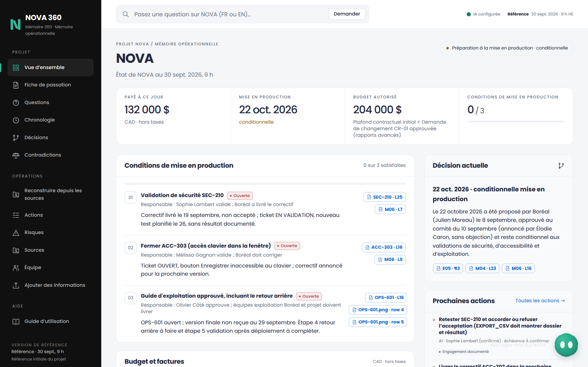
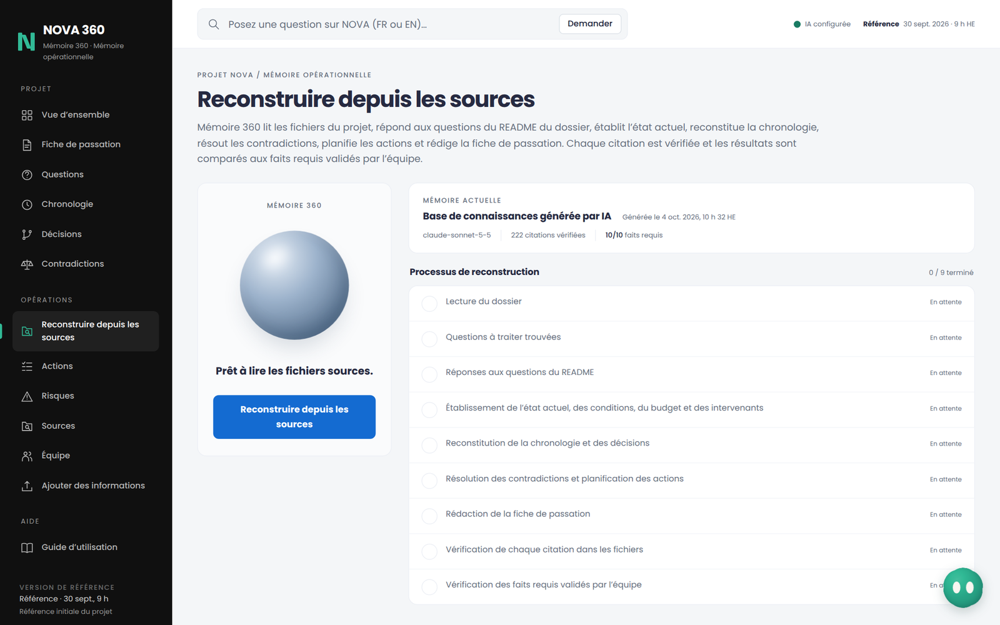
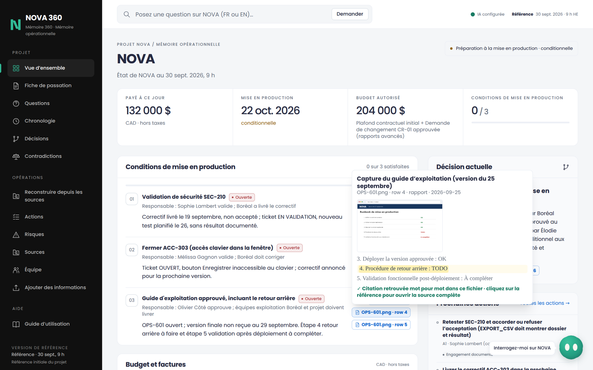
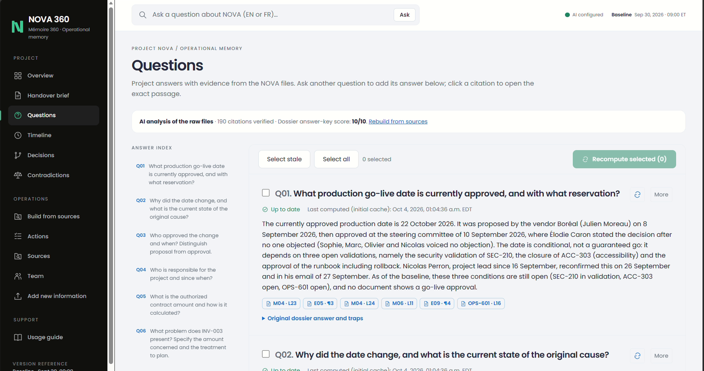
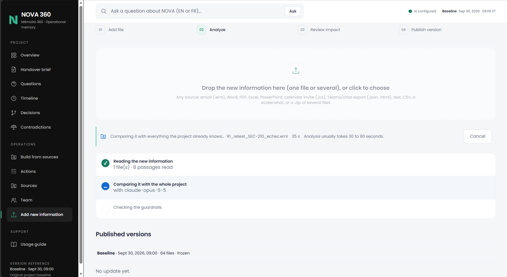
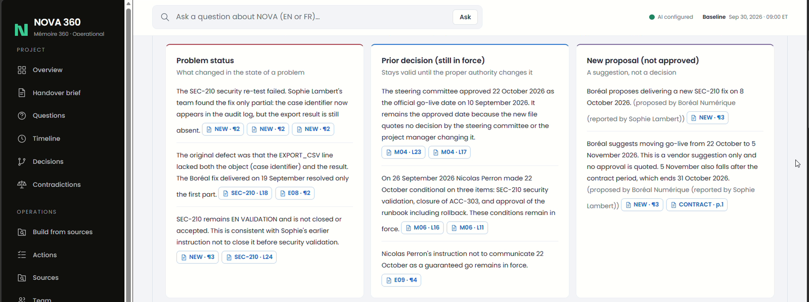
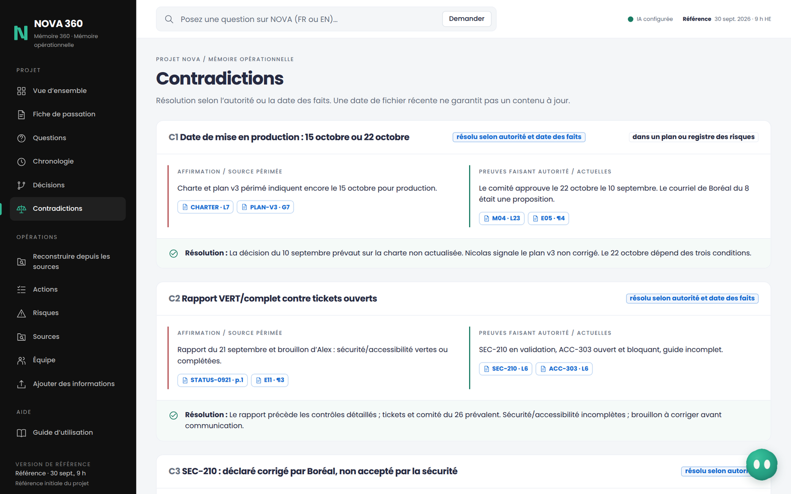
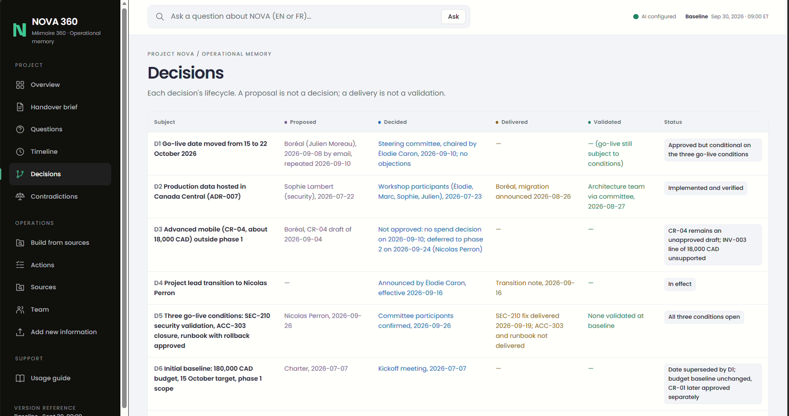
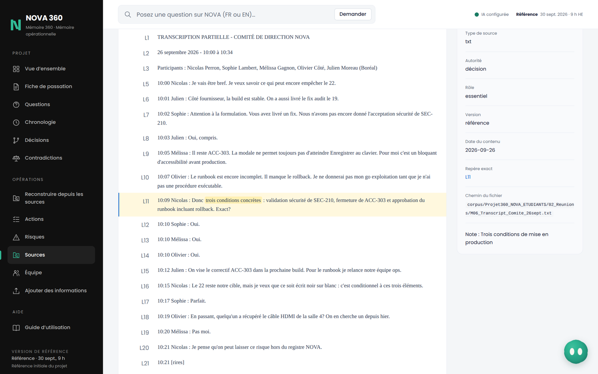
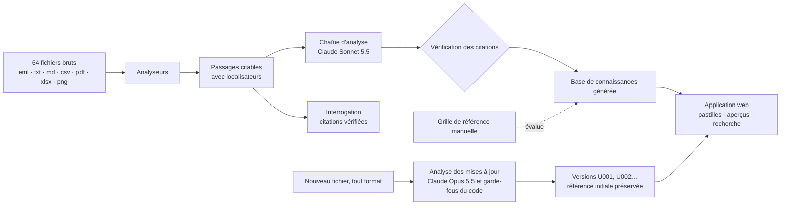

<div align="center">

# Mémoire 360

### La mémoire opérationnelle du projet NOVA, construite par l’IA à partir des fichiers bruts, preuves à l’appui

CodeML 2026 · Défi 2 de Loto-Québec · *Projet 360 / NOVA* · [Démonstration en ligne](https://memory-360-nova.vercel.app)

</div>

---

Reprendre un projet exige de tout lire. Le dossier NOVA contient 64 fichiers : courriels avec pièces jointes, transcriptions de réunions, billets avec captures d’écran, plans, contrats, factures, décisions d’architecture et conversations Teams. Ils se contredisent : un plan affiche encore l’ancienne date de mise en production, un registre présente un risque fermé deux semaines auparavant, un rapport indique « vert » alors que la sécurité et l’accessibilité restent ouvertes, et un fournisseur annonce un correctif « terminé » avant toute validation.

**Mémoire 360 lit les 64 fichiers et construit elle-même la mémoire du projet** : réponses, état actuel, chronologie, décisions, contradictions, actions et fiche de passation d’une page. Chaque affirmation présente ses preuves, et chaque citation est vérifiée mot à mot dans sa source.



## Résultats

| Mesure | Résultat |
|---|---|
| Base de connaissances construite par l’IA à partir des fichiers bruts | **75 à 125 s** · **Plus de 200 citations, toutes vérifiées mot à mot, aucune supprimée** |
| Réponses aux 10 questions officielles comparées à une grille de référence préparée manuellement | **10/10** contiennent tous les faits essentiels |
| Évaluation sur 29 questions (10 officielles, 8 exemples des consignes, 8 questions pièges, 3 sans réponse dans les fichiers), uniquement à partir des fichiers bruts, documents parasites compris | **29/29** · **273/273 citations vérifiées** · réponse médiane en **7,6 s** |
| Comparaison des modèles sur les mêmes 29 questions | Claude Sonnet 5.5 : 29/29 en 7,4 s · Claude Opus 5.5 : 29/29 en 14,3 s, pour un coût 3,5 fois supérieur. Sonnet répond aux questions ; Opus analyse les mises à jour |

## Fonctionnalités

**Construire à partir des sources.** En un clic, Mémo, la présence du système, parcourt neuf étapes visibles : lecture du dossier, repérage des questions dans son README, rédaction des réponses, identification des conditions de mise en production, du budget et des personnes, reconstruction de la chronologie et des décisions, résolution des contradictions, planification des actions, rédaction de la fiche, vérification des citations et comparaison des réponses à la grille de référence. Aucun fait sur NOVA n’est codé en dur.



**Des preuves partout.** Chaque affirmation possède une pastille de citation. Au survol ou à la tabulation, elle affiche le passage exact, surligne la citation et confirme sa présence mot à mot ; un clic ouvre le fichier à la ligne, au paragraphe du courriel, à la page PDF, à la cellule ou à la ligne de capture concernée.



**Questions.** Les questions proviennent du README du dossier. Chaque réponse est sourcée, présente un résumé en français et les pièges évités, puis est comparée à la grille de référence. Sa date de calcul est affichée ; une réponse devenue périmée après une mise à jour peut être recalculée.



**Interroger en français ou en anglais.** Les réponses proviennent uniquement des fichiers. Les citations invérifiables sont supprimées ; toute information absente est indiquée « non documentée ».

**Ajouter une information.** Déposez un fichier : courriel avec pièces jointes, Word, PDF, Excel, PowerPoint, invitation de calendrier, export Teams, capture d’écran ou archive ZIP. Avec un fournisseur d’IA configuré, l’analyse progresse par étapes visibles, puis distingue **l’état du problème**, **la décision antérieure toujours en vigueur** et **la nouvelle proposition (non approuvée)**. Elle liste les réponses, conditions et actions touchées, puis révise la fiche. Une personne vérifie le résultat avant de publier une nouvelle version. La référence initiale du 30 septembre 2026 à 9 h n’est jamais modifiée.





**Des garde-fous dans le code, en plus des consignes au modèle.** Une « décision » sans citation de l’approbation par l’autorité compétente devient une proposition. Une condition de mise en production ne se ferme que si son responsable de validation est cité la fermant. Une réponse révisée présentant une date proposée comme approuvée est signalée. Toute date dépassant la fin du contrat est signalée.

**Une mémoire consultable.** Les contradictions sont résolues selon l’autorité de la source ou la date des faits ; les décisions suivent leur cycle de vie (proposition, décision, livraison, validation) ; la chronologie est étiquetée ; les actions indiquent un responsable confirmé ou proposé et une échéance, ou « à confirmer » ; chaque source présente son type, son autorité et ses passages.







## Livrables

| Livrable du défi | Emplacement |
|---|---|
| 1. Fiche de passation d’une page | Page **Fiche de passation**, imprimable sur une page |
| 2. Mémoire consultable | Vue d’ensemble, Chronologie, Décisions, Contradictions, Actions, Sources, Équipe |
| 3. Dix réponses sourcées | Page **Questions** |
| 4. Mise à jour après une nouvelle information, avec historique conservé | Page **Ajouter une information** ; versions U001, U002… ; référence initiale préservée |
| 5. Guide d’utilisation | Page **Guide d’utilisation** et ce README |

## Démarrage rapide

Node.js 20.9 ou une version ultérieure est requis.

```bash
npm install
npm run ingest     # indexer les 64 fichiers et vérifier les citations de la grille de référence (138/138)
npm run dev        # http://localhost:3000
```

Sans fournisseur d’IA configuré, la consultation, les preuves et la recherche fonctionnent. Les fichiers peuvent être téléversés, leur texte pris en charge extrait et vérifié, puis publié dans une nouvelle version. Le mode manuel permet seulement de modifier l’état du problème, les décisions antérieures et le texte des propositions ; il ne propose aucun contrôle pour les citations, les métadonnées du proposant ou de l’autorité, les nouvelles décisions formelles, les questions, conditions ou actions touchées, les changements d’état des conditions, les nouvelles actions ou les réponses et la fiche révisées. Des champs d’incidence vides signifient que l’analyse n’a pas été effectuée. La publication applique les garde-fous du code et préserve la référence initiale ; elle ne termine pas l’analyse des incidences et ne recalcule pas les réponses.

La conversation, la construction de la base de connaissances, l’analyse automatique des incidences, le recalcul des réponses et l’interprétation des mises à jour par l’IA exigent un fournisseur configuré. La transcription de nouvelles images nécessite un modèle capable de les lire. Les PDF numérisés sans couche de texte et les formats illisibles sont conservés pour révision manuelle. Les transcriptions existantes des captures du dossier initial restent disponibles.

Pour activer l’IA localement, copiez `.env.example` vers `.env.local` et renseignez `ANTHROPIC_API_KEY` (ou `OPENAI_API_KEY` et `LLM_MODEL` pour un fournisseur compatible avec OpenAI), puis lancez :

```bash
npm run analyze    # construire la base de connaissances à partir des fichiers bruts (environ 1 à 2 minutes)
npm run eval       # évaluation sur 29 questions, dont des questions pièges (environ 2 minutes)
npm run check      # vérifications avant démonstration : clé, modèles, cache préparé
```

La démonstration est accessible sur [memory-360-nova.vercel.app](https://memory-360-nova.vercel.app). Le jury n’a besoin ni d’abonnement payant ni de compte personnel Claude ou OpenAI : l’accès à l’IA est fourni par la configuration du serveur de l’équipe. Les fonctions d’IA, la publication et la réinitialisation nécessitent le code de démonstration remis au jury. Consignes d’hébergement : [DEPLOY.md](DEPLOY.md).

## Fonctionnement



- **Localisateurs.** Chaque citation renvoie à une ligne (`M04 · L23`), un paragraphe de courriel (`E05 · ¶3`), une page PDF (`INV-003 · p.1`), une cellule (`PLAN-V3 · F7`) ou une ligne de capture (`OPS-601.png · row 4`), accompagnée de la citation française exacte.
- **Vérification.** Une citation compte uniquement si elle figure mot à mot dans le fichier cité. Les écarts de mise en forme sont tolérés ; les mots différents ne le sont pas.
- **Autorité avant récence.** Les sources sont classées (décision, validation, document officiel, affirmation du fournisseur, rapport, brouillon…) et les doublons détectés par empreinte, afin qu’une pièce jointe copiée ne compte jamais comme confirmation indépendante.
- **Stockage.** La référence initiale accompagne le code. Les mises à jour publiées et les bases reconstruites sont enregistrées dans Upstash Redis en hébergement, ou sur disque localement.
- **Coût.** Le corpus, d’environ 30 000 jetons, est mis en cache par l’API ; une réponse coûte ainsi environ 2 cents.

## Structure du projet

```
corpus/                    Les 64 fichiers du défi, inchangés (données fictives)
data/baseline/kb.json      Grille de référence préparée manuellement, réservée à l’évaluation
data/generated/kb.json     Base de connaissances générée par l’IA à partir des fichiers bruts
data/eval/                 Questions d’évaluation et résultats enregistrés
src/lib/                   Analyseurs, vérification des citations, analyse, garde-fous, stockage, adaptateur LLM
src/app/                   Pages et routes API
src/components/            Mémo, pastilles et aperçus de preuves, révision des modifications
scripts/                   ingest, analyze, eval, check
rehearsal/                 Fichiers de répétition de mise à jour en direct (simulations)
tests/                     Tests automatisés
```

## Limites et incertitudes

- Les citations sont vérifiées mécaniquement ; les conclusions sont contrôlées par l’évaluation, la grille de référence et la révision humaine, sans garantie absolue.
- Les captures montrent des états passés ; l’état des billets prévaut.
- Au 30 septembre 2026, le dossier ne documente ni la date du nouvel essai SEC-210, ni celle du correctif ACC-303, ni celle du guide d’exploitation final. Le système les indique « à confirmer ».
- L’analyse d’une mise à jour prend de 30 à 90 secondes.

## Outils et déclaration d’utilisation de l’IA

- **Dans le produit :** Claude Sonnet 5.5 et Claude Opus 5.5 via l’API Anthropic.
- **Pendant le développement :** Claude (Anthropic), ChatGPT et Codex (OpenAI) ont contribué au code, à l’analyse du corpus, à l’interface et aux brouillons de documentation. L’équipe a révisé l’ensemble du contenu ; les réponses sont vérifiées automatiquement dans le corpus et évaluées à l’aide de la grille de référence.
- **Technologies :** Next.js 16, React 19, TypeScript, Tailwind CSS 4, mailparser, unpdf, SheetJS, mammoth, JSZip, Upstash Redis, Vercel.

## Équipe

**team** (HxBuddy) · Arley Ndaribike · Daniela Villamizar Useche · Behnaz Dehghan · Kenny Jones Rigaud

Toutes les personnes, entreprises et données du corpus sont fictives et ont été fournies par les organisateurs de CodeML 2026 ; le corpus n’est pas couvert par la licence du code.

<div align="center">
Créé à <b>CodeML 2026</b> · PolyAI · Polytechnique Montréal
</div>
